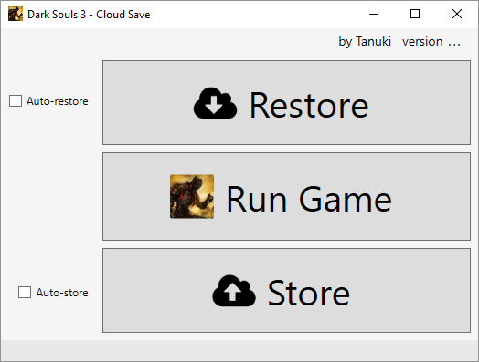

# Download [](https://github.com/TanukiSharp/DarkSoulsCloudSave/raw/master/Builds/win-x64/DarkSoulsCloudSave_1.1.0.zip) [](https://github.com/TanukiSharp/DarkSoulsCloudSave/raw/master/Builds/linux-x64/DarkSoulsCloudSave_1.1.0.zip)


There is a `Builds` directory that contains binaries ready to be executed, for the ones not familiar with technical aspects. Still, read the `Requirements` section below.

# Overview

SteamCloudSave is a software that helps you store and restore your Steam game save data to the cloud.

It also allows you to easily restore save data from the cloud, and so by definition can be used as the "Cloud Save" feature that is missing to the Steam version of some games.

For now, Dropbox and Google Drive can be used as cloud storages, so you will need a Dropbox account and/or a Google account to use it. (creating those accounts is free)

This software has been written with extensibility in mind, so in the future it **could** be possible to add other cloud storage services.



# Disclaimer

You have to clearly understand the risks when using this software incorrectly.

There is a save data backup feature integrated to minimize the risks, but it is always possible to mess things up.

The software is provided "as is", therefore, the authors and contributors cannot be held responsible for any harm resulting from the use of this software.

# Requirements

This software requires:
* .NET 8+
* A Dropbox and/or a Google account

Put the application on your disk where it has read and write access.
For example, avoid using `Program Files` folder.

# How to get it running

This application is not provided with an installer, so you need to download the zip file, extract it, and run the file `SteamCloudSave.exe` on Windows and `SteamCloudSave` on Linux.

Note that you will need to have installed .NET 8 or higher on your machine.

When the application runs, some files are created. If you download another version of the application, you will have three options:

- Copy configuration files from previous version's folder to current version's folder
- Overwrite previous version's file with new version's file (beware to delete all previous files before)
- To not reuse previous configuration and re-configure the new version

# Authorization with Dropbox

When you run the application for the first time, it needs to be authorized to access your Dropbox account.
Hereafter is the procedure.

Your favorite web browser will open a page from Dropbox.


Before proceeding, please **make sure** this is indeed a page from Dropbox. (feel free to check the certificate in doubt)

If the page is not secure or if it is not from Dropbox, **do not** click the `Allow` button, just click `Cancel` and leave the page.

Note: this will grant read and write access to the application's **own folder** inside **your** Dropbox, as stated in the screenshot.
If you disagree with that, do not allow the application. However, the application can only access its own folder and nothing else, of course all your other data remain private.

Once you allowed, you are invited to close the browser's page and return to the application.

Note: This procedure has to be done only once, but it has to be done on each machine you want to use the application.

# Authorization with Google Drive

When you run the application for the first time, it needs to be authorized to access your Google Drive account.

Once the authorization process starts, a browser should open, asking you to choose the Google account you want to use to store your DS3 saves.
Then, allow the application to access storage.

Note that this will only grant access to a separate store only accessible by this application, and this application will never be able to access anything else in your Google Drive.

Once allowed, you should see a message such as:

```
Received verification code. You may now close this window.
```

At that moment, you can close that browser's page and the application is ready to use.

Note: This procedure has to be done only once, but it has to be done on each machine you want to use the application.

# Security considerations

Thanks to the code you provided to the application during the authorization process, an `access token` can be obtained from Dropbox.

The `access token` is what proves to Dropbox that the application has been granted access.

It is stored encrypted in the file `storageconfig/DropboxCloudStorage.config` on Windows only, other platforms store the access token in clear.

It can only be decrypted on the machine and by the logged-in user that generated it, so the `access token` will simply be considered corrupted on another machine or on the same machine but if you are logged-in with another user.
Please **make sure to understand** that it means somebody with a physical access to your machine while you are logged-in, could decrypt the `access token`.

As stated before, the `access token` could grant somebody write access (and thus delete) to your `Apps/DarkSoulsCloudSave` folder on Dropbox. (only this folder, not the remaining of your Dropbox content)

If you think you have been stolen this `access token`, you'd rather revoke access from your Dropbox account as soon as possible.

# How the application works

From now on, Dropbox / Google Drive will be abstracted to 'the cloud', as much as possible, since any other cloud storage service could be used instead.

## Store

When clicking the `Store` button, the application will automatically retrieve your local Dark Souls 3 save data and upload it to the cloud.

Note: if there is save data of several different Steam accounts, they will all be uploaded to the cloud.

Dropbox keeps all the old versions of a file, so in case of problem, you can always revert to any revision.

## Auto-store

The `Auto-store` check box is used to automatically upload save data after running the game. This feature disables the `Store` button so you can't manually click it.

If the `Auto-store` is checked but you run Dark Souls 3 manually from outside the application, the save data will **not** be automatically uploaded to the cloud when you quit the game.
This works only when you click the `Run Game` button from the application.

Note: considering you ran the game by clicking the `Run Game` button and the `Auto-store` is checked, the application will upload save data after the game *stops*, meaning this will also happen if the game crashes or else.

## Restore

Clicking the `Restore` button downloads your save data from the cloud and store it on your local machine, overwriting the previous local save data.

Please do understand that this is the way things could be messed up.

### Backup

A local save data backup feature is integrated in the application.

Save data on local machine are backed up each time you restore from the cloud, to reduce the risk of losing data when local save data is overwritten by the remote save data.

The backups are contained in the `backups` folder, in the form `<filename>_<date>_<time>.zip`, where `<date>` is `<year>-<month>-<day>` and `<time>` is `<hour_24H>-<minutes>-<seconds>-<milliseconds>`

Backups can accumulate quickly, so remember to clean it up from time to time.

It is recommended to always keep at least the three last backups even if everything seems to be alright, just in case.

## Auto-restore

Same as the `Auto-store` feature, this makes the application to automatically download save data before running the game.

## Store and restore availability

The `Store` and `Restore` features are available while the game is running. (unless `Auto-store` and/or `Auto-restore` is/are checked)
You may need this for whatever reason, but be *sure to know what you do* if you try to store and/or restore save data while the game is running.

## Configuration

The application remembers the `Auto-store` and `Auto-restore` states. This is saved in the `DarkSoulsCloudSave.config` file.

# How to build from source code

This application has been written in C# using Avalonia (originally using WPF).

To build it yourself, simply open a terminal in the directory containing the `.sln` file, and type:

```sh
dotnet build
```

You can also open the root directory in Visual Studio Code, Visual Studio 2022 Community Edition, or Rider.

Cloud storage extension libraries have some dependencies, setup as `NuGet` packages.
When you will build, dependencies should be automatically resolved.

To make a release, just run:

```sh
dotnet publish -c Release -r win-x64 # For Windows.
# or
dotnet publish -c Release -r linux-x64 # For Linux.
```

You can run both commands on Windows and Linux, you do not need a Windows machine to build and Windows nor a Linux machine to build on Linux.

The `-c Release` option is used to build in release mode. Feel free to use `-c Debug` for debug mode.

This will create a `Builds/<platform>/DarkSoulsCloudSave_<version>.zip` file. Be careful since this totally deletes a previously existing file with the same name, if any.

# For developers

The `SteamCloudSave.Core` library contains most of the application logic, so if you want to create your own application or service, feel free to use this library as a working base.

The Dropbox cloud storage implementation is in the `SteamCloudSave.DropboxExtension` library.

A Google Drive implementation is also available in the `SteamCloudSave.GoogleDriveExtension` library.

# License

This software is provided as WTFPL.
http://www.wtfpl.net/

# Request from the authors

Please avoid using this software to cheat. (save-scumming)

If the community remains respectful of this kind of simple request, then everybody can enjoy the creations of others, for the good of the community itself.
