# Download 

There is a `Builds` directory that contains binaries ready to be executed, for the ones not familiar with technical aspects.

# Overview

DarkSoulsCloudSave is a software that helps you store and restore your Dark Souls 3 save data to and from the cloud.

It also allows you to easily restore save data from the cloud, and so by definition can be used as a "Cloud Save" feature that is missing to the Steam version of the game.

For now it uses Dropbox as cloud storage, so you will need a Dropbox account to use it. (creating a Dropbox account is free)

This software has been written with extensibility in mind, so in the future it **could** be possible to switch to another cloud storage service. *(now experimenting Google Drive cloud storage)*

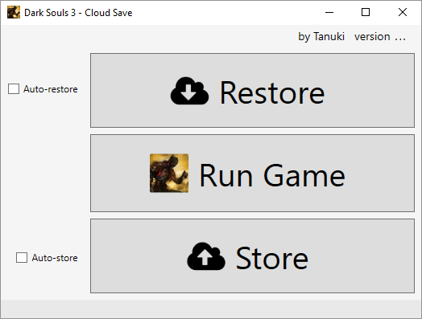

# Disclaimer

You have to clearly understand the risks when using this software incorrectly.

There is a save data backup feature integrated to minimize the risks, but it is always possible to mess things up.

The software is provided "as is", therefore, the authors and contributors cannot be held responsible for any harm resulting from the use of this software.

# Requirements

This software requires:
* .NET Framework 4.5
* A Dropbox account

.NET Frameworks 4.5 is preinstalled on Windows 8 and higher. It can be installed separately on Vista SP2 and higher.

Windows XP and Vista SP1 are not supported.

https://msdn.microsoft.com/en-us/library/8z6watww(v=vs.110).aspx

Put the application on your disk where it has read and write access.
For example, avoid using `Program Files` folder.

# Authorization

When you run the application for the first time, it needs to be authorized to access your Dropbox account.
Hereafter is the procedure.

The first dialog box tells you that a web page to Dropbox will open, asking you to allow `DarkSoulsCloudSave` application to access its own folder in your Dropbox account.

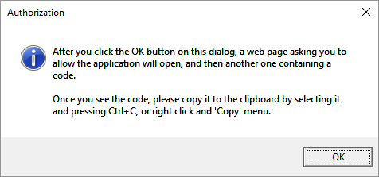

Once you click the `OK` button, your favorite web browser will open a page from Dropbox.

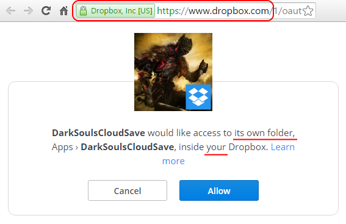

Before proceeding, please **make sure** this is indeed a page from Dropbox.
You should see the Dropbox Inc highlithed in green beside the dropbox.com address. (feel free to check the certificate in doubt)

If the page is not secure or if it is not from Dropbox, **do not** click the `Allow` button, just click `Cancel` and leave the page.

Note: this will grant read and write access to **its own folder** but inside **your** Dropbox, as stated in the screenshot.
If you disagree with that, do not allow the application. However, the application can only access its own folder and nothing else, of course all your other data remain private and safe.

Once you allowed, you should be redirected to a page providing you a code.

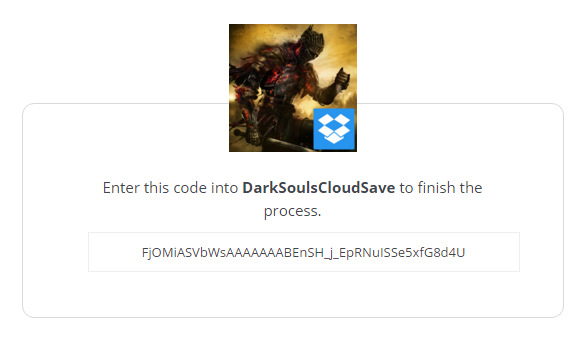

And so, as stated in the very first dialog box, copy this code to the clipboard.

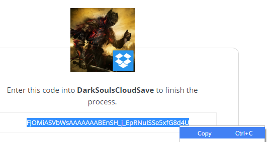

Then return to the application, where you should see the following dialog, telling you that once you click the `OK` button, the application will read the clipboard in order to retrieve the code provided by Dropbox.

Please make sure to not copy anything else between the moment you copied the code and the moment you click the `OK` button, or this would invalidate the clipboard and fill it with data that makes no sense to Dropbox.

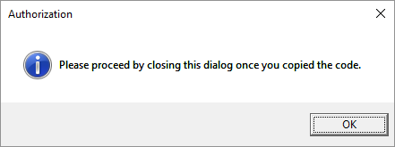

Finally, if everything goes right, the application confirms you that it succeeded.

If this is not the case, please file an issue and I will try to answer as fast as possible.

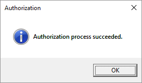
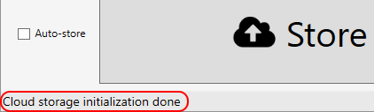

Note: This procedure has to be done only once, but it has to be done on each machine you want to use the application.

# Security considerations

Thanks to the code you provided to the application during the authorization process, an `access token` can be obtained from Dropbox.

The `access token` is what proves to Dropbox that the application has been granted access.

It is stored encrypted in the file `storageconfig/DropboxCloudStorage.config`.

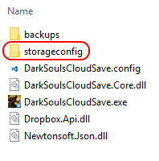

It can only be decrypted on the machine and by the logged-in user that generated it, so the `access token` will simply be considered corrupted on another machine or on the same machine but if you are logged-in with another user.
Please **make sure to understand** that it means somebody with a physical access to your machine while you are logged-in, could decrypt the `access token`.

As stated before, the `access token` could grant somebody write access (and thus delete) to your `Apps/DarkSoulsCloudSave` folder on Dropbox. (only this folder, not the remaining of your Dropbox content)

If you think you have been stolen this `access token`, you'd rather revoke access from your Dropbox account as soon as possible.

# How the application works

From now on, Dropbox will be abstracted to 'the cloud', as much as possible, since any other cloud storage service could be used instead.

## Store

When clicking the `Store` button, the application will automatically retrieve your local Dark Souls 3 save data and upload it to the cloud.

Note: if there is save data of several different Steam accounts, they will all be uploaded to the cloud.

Dropbox keeps all the old versions of a file, so in case of problem, you can always revert to any revision.

## Auto-store

The `Auto-store` check box is used to automatically upload save data after running the game. This feature disables the `Store` button so you can't manually click it.

If the `Auto-store` is checked but you run Dark Souls 3 manually from outside the application, the save data will **not** be automatically uploaded to the cloud when you quit the game.
This works only when you click the `Run Game` button from the application.

Note: considering you ran the game by clicking the `Run Game` button and the `Auto-store` is checked, the application will upload save data after the game *stops*, meaning this will also happen if the game crashes or else.

## Restore

Cilcking the `Restore` button downloads your save data from the cloud and store it on your local machine, overwriting the previous local save data.

Please do understand that this is the way things could be messed up.

### Backup

A local save data backup feature is integrated in the application.

Save data on local machine are backed up each time you restore from the cloud, to reduce the risk of losing data when local save data is overwritten by the remote save data.

The backups are contained in the `backups` folder, in the form `<filename>_<date>_<time>.zip`, where `<date>` is `<year>-<month>-<day>` and `<time>` is `<hour_24H>-<minutes>-<seconds>-<milliseconds>`

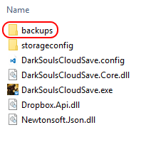

Backups can accumulate quickly, so remember to clean it up from time to time.

It is recommended to always keep at least the three last backups even if everything seems to be alright, just in case.

## Auto-restore

Same as the `Auto-store` feature, this makes the application to automatically download save data before running the game.

## Store and restore availability

The `Store` and `Restore` features are available while the game is running. (unless `Auto-store` and/or `Auto-restore` is/are checked)
You may need this for whatever reason, but be *sure to know what you do* if you try to store and/or restore save data while the game is running.

## Configuration

The application remembers the `Auto-store` and `Auto-restore` states. This is saved in the `DarkSoulsCloudSave.config` file.

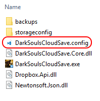

# How to build from source code

This application has been written in C# using WPF. (Windows Presentation Foundation)

To build it yourself, you will need Visual Studio 2015 Community Edition. (available for free)

Open the `DarkSoulsCloudSave.sln` file with Visual Studio, then build the application. (menu Build / Build Solution)

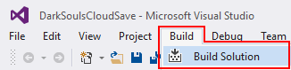

Cloud storage extension libraries have some dependencies, setup as `NuGet` packages.
When you will build, dependencies should be automatically resolved by Visual Studio.

The way builds are made is, compile in `Release` configuration, then run the script `DarkSoulsCloudSave\bin\MakeBuildFromRelease.bat`.

This creates a `Build\DarkSoulsCloudSave` folder and copies only the necessary files from the `Release` folder. Becareful since this totally erase a previously existing `Build` folder and its content, if any.

# For developers

The `DarksSoulsCloudSave.Core` library contains most of the application logic, so if you want to create your own application or service, feel free to use this library as a working base.

The Dropbox cloud storage implementation is in the `DarkSoulsCloudSave.DropboxExtension` library.

An experimental `DarkSoulsCloudSave.GoogleDriveExtension` is also available and operational, but please read the `Experiments` section bellow before using it.

# License

This software is provided as WTFPL.
http://www.wtfpl.net/

# Experiments

I'm now experimenting a Google Drive based cloud storage implementation, but there are a few issues for the moment.

Despite technical difficulties, there are some limitations in the product that makes me feel unconfortable for the moment, as stated on the following page, section `What is the Application Data folder?`.
https://developers.google.com/drive/v3/web/appdata

This document is intended to developers, so as an end-user, when you read it, replace `your application` by `DarkSoulsCloudSave` and `the user` by `you`.

# Request from the authors

Please avoid using this software to cheat. (save-scumming)

If the community remains respectful of this kind of simple request, then everybody can enjoy the creations of others, for the good of the community itself.
